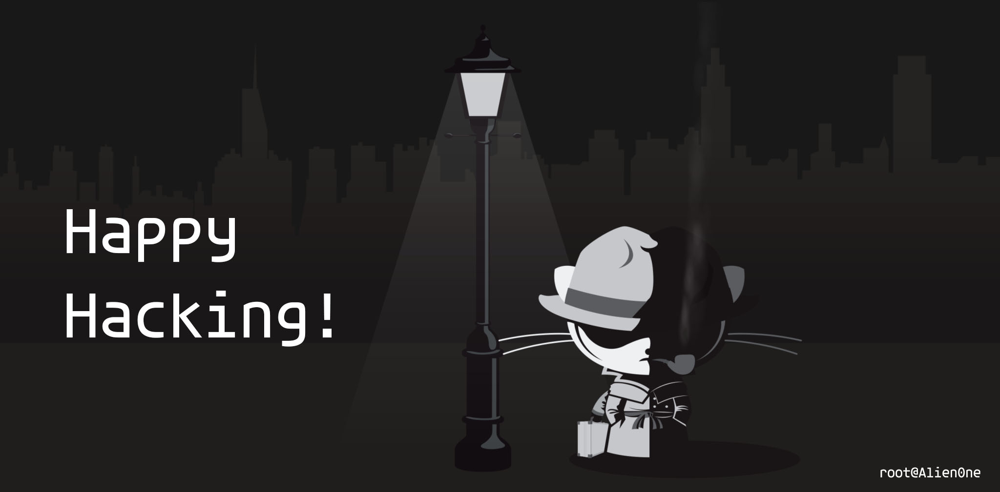

<h1 align="center">Hi 👋, I'm Narasimha Tiruveedula (Alien0ne)</h1>

  

<h3>About me :</h3>
<h4 align="left">I am Cybersecurity enthusiast from INDIA. 
  I have practical experience of
pentesting, web hacking, networking and wireless hacking. 
  I want to continue
my career in cybersecurity, where I can apply my knowledge and skills to
continually enhance myself.</h4>

- 🔭 I’m currently working on [100-redteam-projects](https://github.com/Alien0ne/100-redteam-projects)

- 📝 I regularly write articles on [My Blog](https://blog.alienone.in/)

- 📫 How to reach me **alienone988@gmail.com**

<h3 align="left">Languages and Tools:</h3>

